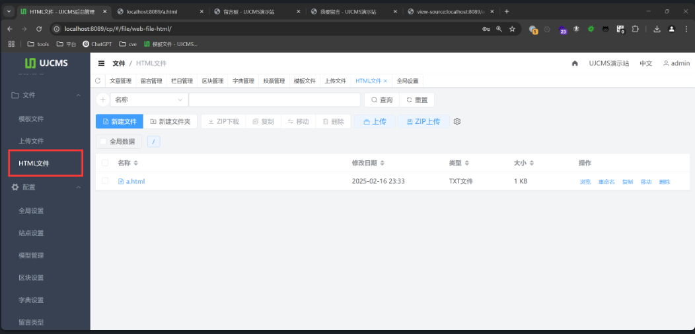
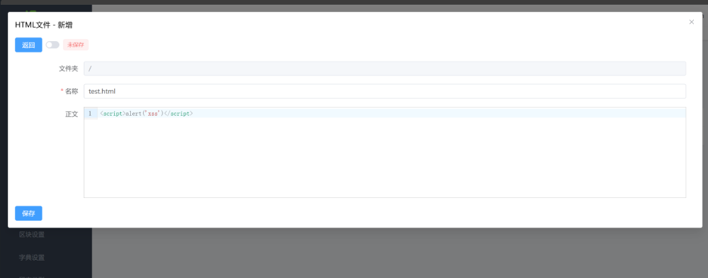
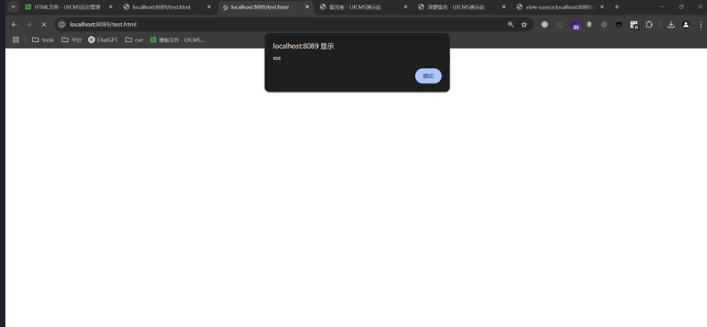

## XSS in HTML file functionality

### Vulnerability Description

UJCMS is an open-source Java-based website content management system (Java CMS) and website building system. It is developed using technologies such as SpringBoot, MyBatis, Spring Security, Lucene, FreeMarker, TypeScript, Vue3, and ElementPlus. It is licensed under the `Apache-2.0` open-source license and can be freely used for commercial websites.

In UJCMS version 9.7.5, a stored XSS vulnerability exists. This vulnerability occurs due to insufficient input validation and sanitization, allowing attackers to inject malicious scripts into webpages. When other users visit the page, the malicious JS code is executed, triggering the XSS vulnerability.

Vendor project open-source repository:
https://gitee.com/dromara/ujcms
https://github.com/dromara/ujcms

Official website: [UJCMS Official Website - Open Source Java CMS Website Content Management System](https://www.ujcms.com/)


### Attack Scenario

1. Log in to the admin panel and create a new HTML file.



2. Write the following content as a proof of concept (PoC):


```r
<script>alert('xss')</script>
```

3. The file will be uploaded to the homepage path, and visiting the file will trigger the XSS vulnerability:
```
http://127.0.0.1/test.html
```

