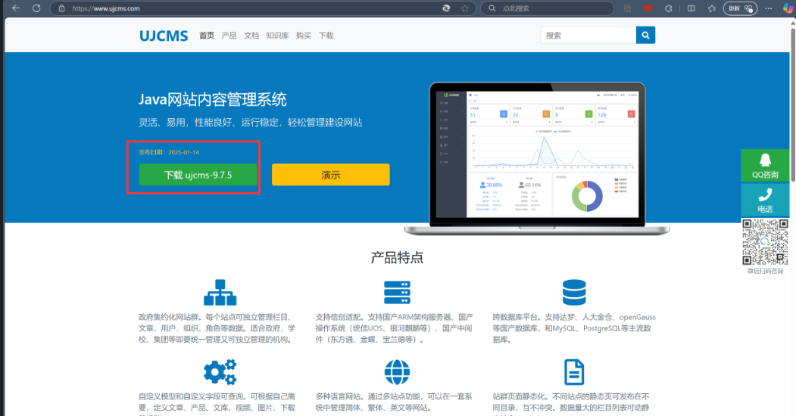
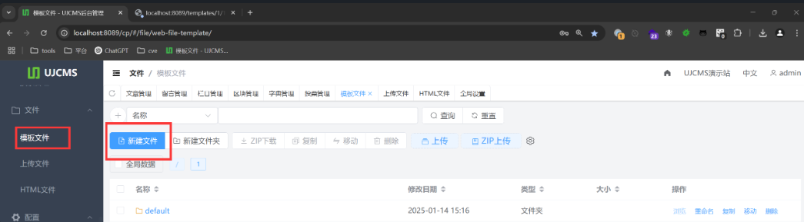
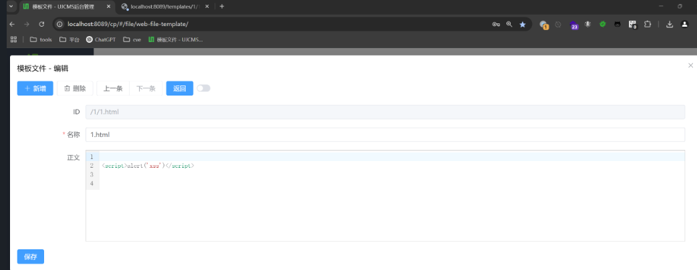
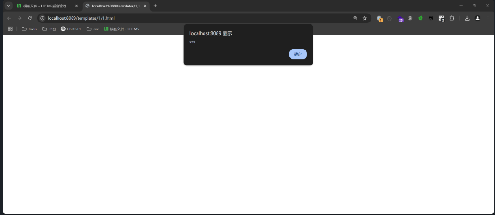

## XSS in Template file function

### Vulnerability Description

UJCMS is an open-source Java-based website content management system (Java CMS) and website building system. It is developed using technologies such as SpringBoot, MyBatis, Spring Security, Lucene, FreeMarker, TypeScript, Vue3, and ElementPlus. It is licensed under the `Apache-2.0` open-source license and can be freely used for commercial websites.

In UJCMS version 9.7.5, a stored XSS vulnerability exists. This vulnerability occurs due to insufficient input validation and sanitization, allowing attackers to inject malicious scripts into webpages. When other users visit the page, the malicious JS code is executed, triggering the XSS vulnerability.

Vendor project open-source repository:  
https://gitee.com/dromara/ujcms  
https://github.com/dromara/ujcms

Official website: [UJCMS Official Website - Open Source Java CMS Website Content Management System](https://www.ujcms.com/)  


### Attack Scenario

Log in to the admin panel . Create a new template file  
  
Write the PoC  
  
```r
<script>alert('xss')</script>
```

The template is uploaded to the `/templates/1/` folder, and visiting it will trigger the XSS.  
```
http://localhost:8089/templates/1/1.html
```
